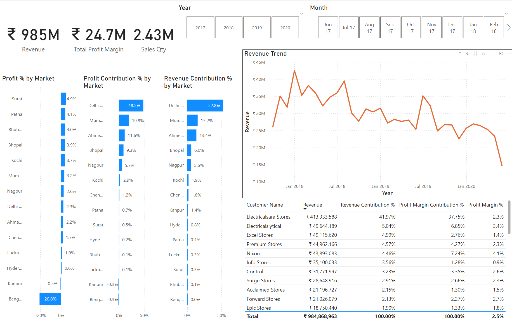

# 📊 Sales Insights Dashboard

## 🚀 Project Overview
This project is a **Power BI dashboard** that analyzes sales performance for a **Brick & Mortar and E-Commerce business**. The dashboard provides insights into **revenue trends, profit margins, and key customer and product metrics** to support data-driven decision-making.

## 🛠️ Tools Used
- **Power BI** – For data visualization and interactive dashboard creation
- **SQL (MySQL)** – For data generation, extraction, transformation, and analysis
- **MySQL Database Dump** – The dataset for this project is generated using a MySQL database dump (db_dump_version_2.sql), which contains structured data for transactions, customers, markets, and products.

## 📈 Key Insights
🔹 **Revenue Performance**
- Total revenue: **₹985M**  
- Monthly revenue trend shows seasonal patterns and fluctuations.

🔹 **Top Markets & Customers**
- Highest revenue contribution: **Delhi (₹520M)**
- Largest customer: **Electricalsara Stores (₹413M revenue)**

🔹 **Profitability**
- Total profit margin: **₹24.7M**  
- Delhi contributes the most profit (48.5%), while some markets have negative margins.

## 📊 Dashboard Features
- **Revenue & Sales Trends** – Line charts to track revenue over time.
- **Market Performance** – Bar charts showing sales & profit contribution by region.
- **Top Customers & Products** – Identify key customers and best-selling products.
- **Dynamic Filters** – Users can filter by year and month to analyze trends.

## 📂 Dataset Information
| Table | Description |
|--------|------------|
| `transactions` | Sales transactions with product, market, and revenue details |
| `customers` | Customer details (Brick & Mortar, E-Commerce) |
| `markets` | Market information with region classifications |
| `products` | Product categories (Own Brand, Distribution) |
| `date` | Date dimension for time-based analysis |

## 📸 Dashboard Screenshot


## 🔌 How to Use
1. **Clone the repository**:
   ```sh
   git clone https://github.com/yourusername/sales-insights-dashboard.git

